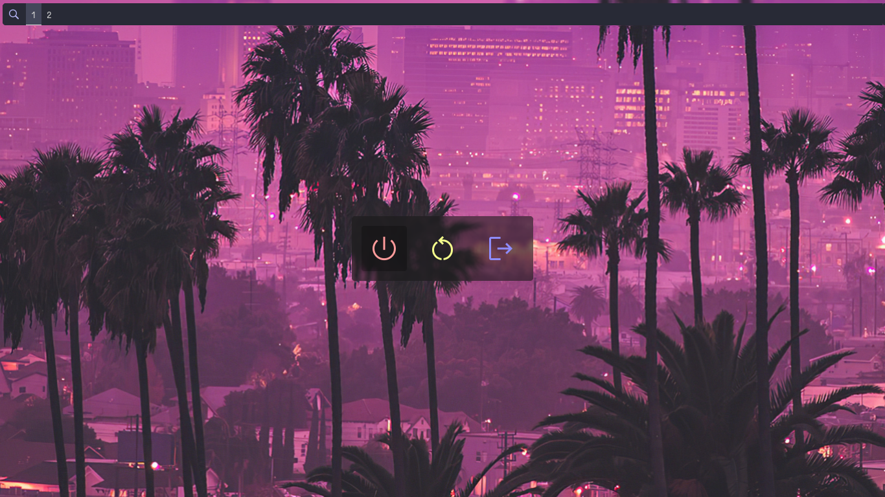

<div align="center">
    
    <h3>A GTK based power menu</h3>
</div>

## ❗️ Install:

**This program have Linux as target system, we don't give support for any other system**

```bash
git clone https://github.com/z3oxs/vendetta.git && cd rough
make install
```

&nbsp;

## ❗️ Update:
```bash
git clone https://github.com/z3oxs/vendetta.git && cd rough
make update
```

&nbsp;

Or, if you maintain the source code
```bash
git pull origin master
make update
```

&nbsp;
## 🚀 Usage:
Running:
```bash
vendetta
```

&nbsp;

## ⚙️ Configuration:

Default template: "YOURHOME/.config/vendetta/config.json"
```json
{
    "window": {
        "background_color": "0, 0, 0",
        "opacity": 1.0,
    },
    "commands": {
        "shutdown": "poweroff",
        "logout": "logout",
        "reboot": "reboot"
    }
}
```

&nbsp;
<div align="center">

## Available options:
### Window
| Option | Description |
|--------|-------------|
| background_color | If transparent enabled, will be the background color (use values between 0 and 1, like "(0.40, 0.42, 0.54)") |
| opacity | If smaller than 1.0, will set a alpha on the background |

&nbsp;

### Commands
| Option | Description |
|--------|-------------|
| shutdown | Shutdown command |
| logout | Logout command |
| reboot | Reboot/Restart command |

</div>
